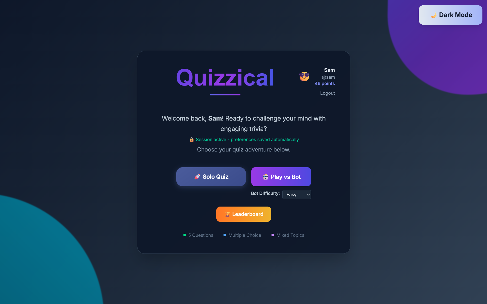
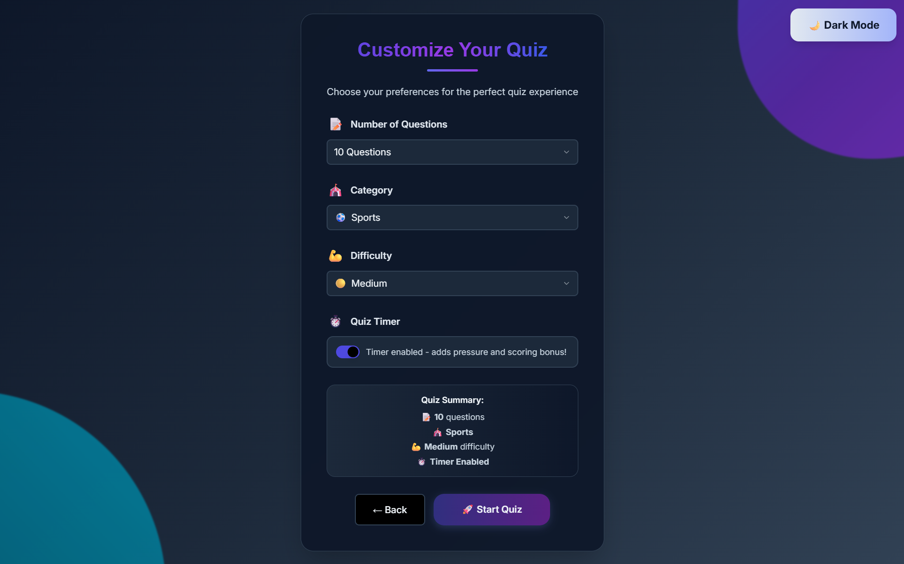
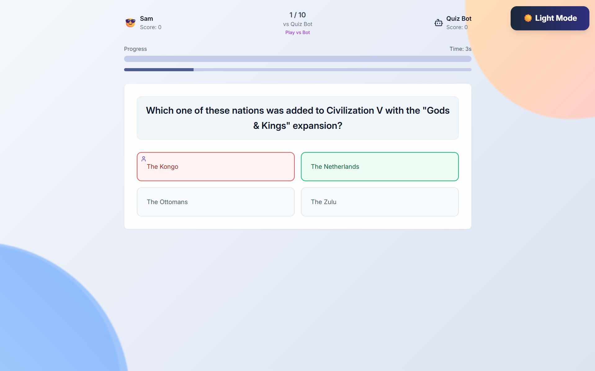

# Quiz (Quizzical)

Full‑stack TypeScript trivia app. React + Vite + Tailwind (shadcn/ui) on the client, served by a single Express server that also exposes JSON APIs and a WebSocket endpoint. Ships with file‑based persistence out of the box (no database required).

- Frontend: React 18, Vite, Tailwind, shadcn/ui
- Backend: Express, TypeScript, WebSocket (ws)
- Persistence: JSON file (`data/users.json`) via server storage layer
- One process serves both API and client at http://localhost:5000

## Screenshots

<div align="center">



<br/><br/>



<br/><br/>



</div>


## Quick start (Windows PowerShell)

Prerequisites:
- Node.js 18+ and npm

Install dependencies:
```powershell
npm install
```

Start in development (API + client at the same port):
```powershell
npm run dev
```
Then open http://localhost:5000

Build for production:
```powershell
npm run build
```

Run production server:
```powershell
npm run start
```

Environment:
- PORT (optional, default 5000)
- No database env vars needed in the default file‑storage mode

## Scripts
- dev: Start Express in dev mode and attach Vite middleware
- build: Build client with Vite to `dist/public` and bundle server to `dist/index.js`
- start: Run the bundled server in production
- check: TypeScript check
- db:push: Drizzle migration command (not required when using file storage)

From `package.json`:
```json
{
  "scripts": {
    "dev": "cross-env NODE_ENV=development tsx server/index.ts",
    "build": "vite build && esbuild server/index.ts --platform=node --packages=external --bundle --format=esm --outdir=dist",
    "start": "cross-env NODE_ENV=production node dist/index.js",
    "check": "tsc",
    "db:push": "drizzle-kit push"
  }
}
```

## Project structure
```
client/                 # React app source (rooted by Vite)
  src/
    components/         # Screens + UI components (shadcn/ui)
    lib/                # Client helpers (API, storage, utils)
    pages/              # Route-level components
server/
  index.ts              # Express bootstrap (serves API + client)
  routes.ts             # REST API + WebSocket setup
  storage.ts            # File-based persistence utilities
shared/
  schema.ts             # Shared types/schemas (imported by client+server)
data/
  users.json            # Persistent storage file
vite.config.ts          # Vite config: aliases @, @shared, @assets; client root
```

## Features
- Solo quiz mode with detailed results and scoring
- Leaderboard (solo) with score, accuracy, average time
- Persistent session, theme, and quiz configuration on the client
- Basic auth (register/login) with bcrypt hashing
- WebSocket endpoint for future multiplayer lobby/rooms

## API overview
Base URL (dev & prod): http://localhost:5000

Auth
- POST `/api/auth/register` — body: `{ username, password, displayName?, avatar? }`
- POST `/api/auth/login` — body: `{ username, password }`

Users
- GET `/api/users/:id` — returns user (no password field)
- POST `/api/users/update-score` — body: `{ userId, pointsChange, isSoloMode }`

Solo results & leaderboard
- POST `/api/solo/save` — body: `{ userId, score, correctAnswers, totalQuestions, averageTime, difficulty?, category?, config? }`
- GET `/api/leaderboard/solo?limit=50&offset=0` — returns top entries

WebSocket
- Path: `ws://localhost:5000/ws`
- Message types: `join_lobby`, `create_room`, `join_room`, `leave_room`, `get_rooms`

## Configuration & data
- PORT: optional, defaults to 5000
- File storage: `data/users.json` holds users, rooms, results
  - To reset data, stop the server and delete `data/users.json` (a fresh file is recreated as needed)

## Development notes
- Path aliases in Vite:
  - `@` → `client/src`
  - `@shared` → `shared`
  - `@assets` → `attached_assets`
- UI built with shadcn/ui + Tailwind; see components under `client/src/components/ui`.
- The single Express process serves both the client and APIs.

## Troubleshooting
- Port already in use: set a different `PORT` or stop the process using 5000.
- Windows line-endings warnings (CRLF/LF): harmless; Git can normalize later.
- After changing public client paths, run `npm run build` again before `npm run start`.

## License
MIT © 2025 MajorUnfazed
